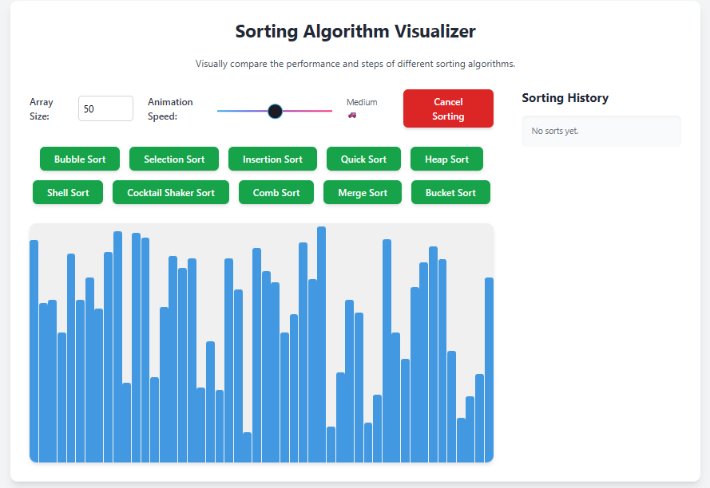

# Sorting Algorithm Visualizer ✨📊

Visually explore and compare different sorting algorithms. This interactive web application brings algorithms to life, allowing you to see their step-by-step execution, track performance metrics, and understand their efficiency.

---

---

## 🚀 Check it Live!

Experience the visualizer directly in your browser:
<https://ds-fall2025.github.io/sorting_algo/>

## 💡 How It Works & Features

This visualizer provides an intuitive interface to interact with sorting algorithms:

* **Dynamic Array Generation:**

    * Adjust the "Array Size" input (between 10 and 200 elements). The visualizer will automatically generate a new random, unsorted array of that size.

* **Adjustable Animation Speed:**

    * Control the visualization speed using the "Animation Speed" slider. It offers discrete, stable speed levels for a smooth viewing experience:

        * Very Slow 🐢🐢🐢 (200ms delay)

        * Slow 🐢 (100ms delay)

        * Medium 🚗 (50ms delay)

        * Fast 🏎️ (20ms delay)

        * Very Fast 🚀 (5ms delay)

        * Super Fast 🔥🔥🔥 (0.01ms delay)

* **Algorithm Selection:**

    * Choose from a variety of popular sorting algorithms by clicking their respective buttons. The visualization will begin immediately.

* **Live Performance Metrics:**

    * During the sorting process, "Comparisons" and "Swaps" are updated live below the visualization area, reflecting the algorithm's actual operations.

    * "Time Taken" displays the **actual execution time** of the algorithm (not tied to animation speed), updating live and showing the final time upon completion.

* **Cancel Sorting:**

    * The "Cancel Sorting" button (located top-right) allows you to stop any ongoing visualization, reset the array to its original unsorted state, and enable controls.

* **Sorting History:**

    * A "Sorting History" panel on the right side of the page keeps a record of all completed sorts, showing the algorithm used, array size, total time taken, comparisons, and swaps. This helps in comparing different runs.

* **Automatic Reset:**

    * After a sort completes and you acknowledge the final message, a new random array is automatically generated, ready for your next experiment!

## 📚 Sorting Algorithms Included

Explore the visual behavior of these common sorting algorithms:

* **Bubble Sort:** Simple, but generally inefficient for large datasets.

* **Selection Sort:** Finds the minimum element and places it at the beginning.

* **Insertion Sort:** Builds the final sorted array one item at a time.

* **Quick Sort:** A highly efficient, divide-and-conquer algorithm.

* **Heap Sort:** Based on the binary heap data structure.

* **Shell Sort:** An optimization of insertion sort, allowing exchange of items that are far apart.

* **Cocktail Shaker Sort:** A bidirectional bubble sort.

* **Comb Sort:** An improvement over bubble sort that eliminates "turtles."

* **Merge Sort:** A stable, divide-and-conquer comparison sort.

* **Bucket Sort:** A non-comparison sort that distributes elements into a number of buckets.

## 💻 Getting Started (Local Setup)

To run this visualizer locally:

1.  **Save the file:** Copy the entire HTML code from the live demo page (or the provided code block) and save it as an `.html` file (e.g., `index.html`).

2.  **Open in browser:** Simply open the saved `index.html` file with your preferred web browser (Chrome, Firefox, Edge, etc.).

No complex setup or server is required!

## 🤝 Contribution: We Get Better With Your Help!

Your contributions are highly welcome! 😁 Feel free to open an issue or submit a pull request.

Made by [Hamid Namjoo 😊](https://hamidnamjoo.com/)
